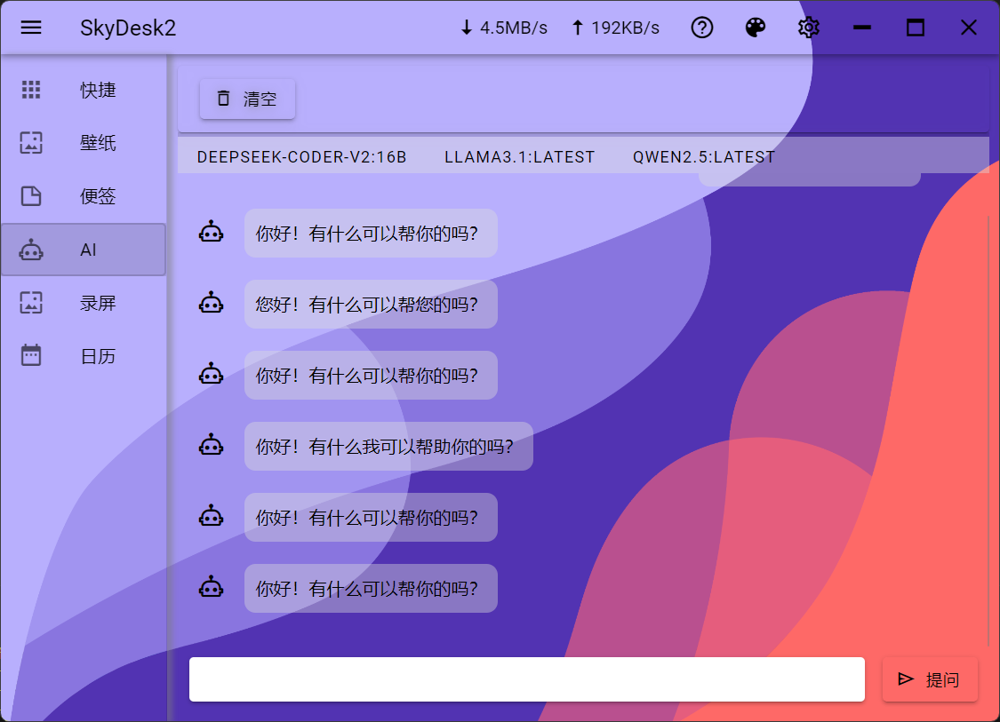

# SkyDesk2 - 一个简单易用的本地工具


## 下载

[下载](https://github.com/angelbests/SkyDesk2/releases) 程序 SkyDesk2


## 开发
此项目需要安装 rust 环境

```
// npm pkg install
npm install
// dev
npm run tauri dev
// build
npm run tauri build
```
## 功能介绍
### 快捷

扫描程序：扫描电脑内的快捷文件，并抓取对应程序的程序图标和名称。通过拖拽的方法拖拽到右侧的快捷栏。


添加桌面合集：将快捷栏中的程序拖拽的桌面合集中即可，拖回主程序删除图标，通过鼠标右键点击弹起自定义配置，自定义桌面合集的样式和大小


鼠标轮盘：点按鼠标中键启动，滑向对应的程序图标既可启动程序。


### 壁纸

1.可以添加图片壁纸、视频壁纸、html 网页壁纸。可实现分屏壁纸<br/>


2.在线壁纸设置和下载，可配置天气等信息，显示在壁纸上层。

3.在线壁纸鼠标右键调起查询选项，添加壁纸后会自动添加到壁纸列表。<br/>


壁纸源：[wallhaven](https://wallhaven.cc/) <br/>
天气 api：[和风天气](https://www.qweather.com/)<br/>

### 便签

添加桌面便签，输入内容或拖拽图片进入即可保存对应信息，鼠标右键点击弹起自定义配置选项。


### 日历

鼠标在日历区域滚动滑轮切换月份，悬浮在年份上滚动切换年份


### AI

需要安装 ollama，并下载安装对应的 AI 模型。



### 录屏

录屏可以随意框选录屏范围，由于个人能力问题，录屏暂无法录制声音。


### 快捷按键

程序托盘状态下可使用 CTRL+1 调起，CTRL+2 隐藏。

### 任务栏和网速


### 设置主程序界面和配置


## 感谢

#### 前端库

vue
vue-router
vue-draggable-plus
vuetify
pinia
pinia-plugin-persistedstate
wangeditor5
ollama
js-calendar-converter
fabric
markdown-it

#### rust 库

windows-rs
rdev
sysinfo
image
windows-capture
tiny_http
chrono
#### sidecar 
[resources_extract](https://www.nirsoft.net/utils/resources_extract.html)
### 此程序用于个人使用和学习使用，不可用于商业行为。
